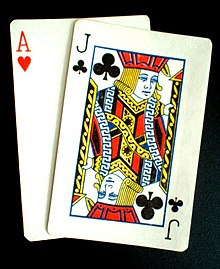

# OOP Card Game



## Bonus Becode Project

In this project we want to build a Card, Player & Board structure. Distribute Cards between the Players, and keep a history on the Board. This is not yet a real game, just setting up the basics of a card game.

This project was a bonus project. If we had still time after the [Hangman](https://github.com/kaygu/hangman-python) project. Its purpose is to apply the python basics we learned in the first days of our training. Have a clean code structure and use class inheritance.

## Minimum Requirments

```txt
Python 3.6
Black 21.5b1
```

## Installation

```bash
git clone https://github.com/kaygu/challenge-card-game-becode.git OOP_Card_Game
cd OOP_Card_Game
pip install requirements.txt
```

## Usage

```bash
python3 main.py
```

## TODO

* Add docstrings

## Possible imporvements

* Distribute points to players for the best card played
* Make game end & select a winner
* Players are controled by humans (now its random card picks)
* Add unit tests